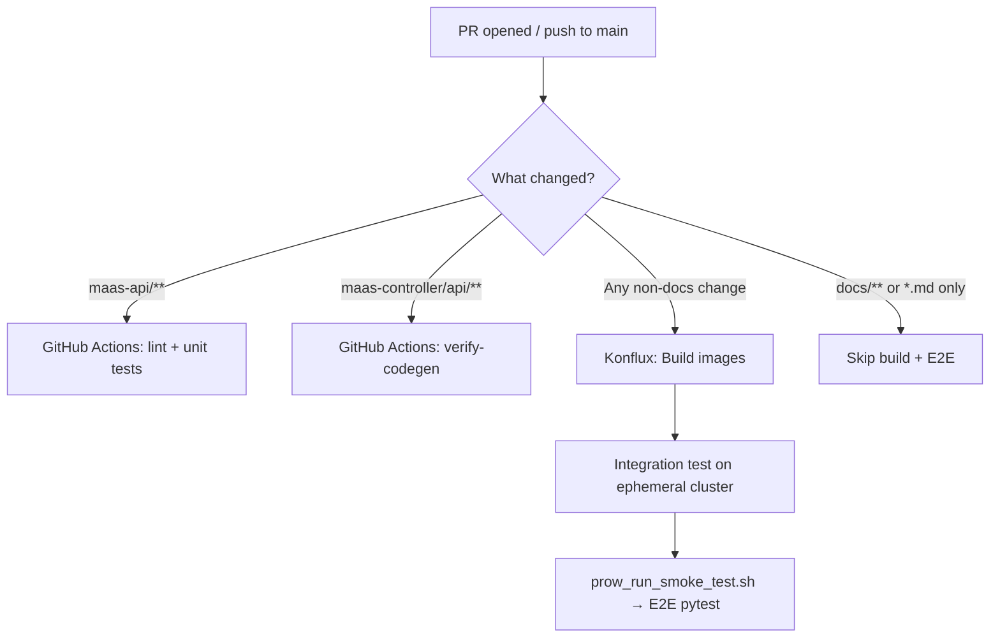

# MaaS Testing and Contribution Guide

This guide covers what tests exist in the MaaS project, how to run them, and how to add new tests when contributing a feature or fix.

## Test Overview

| Type | Location | Language | Runner |
|------|----------|----------|--------|
| **Unit tests** | `maas-api/internal/`, `maas-api/cmd/` | Go | `make test` |
| **Unit tests** | `maas-controller/pkg/` | Go | `make test` |
| **E2E tests** | `test/e2e/tests/` | Python (pytest) | `run-tests-quick.sh`, `smoke.sh` |
| **CI smoke / E2E** | `test/e2e/scripts/prow_run_smoke_test.sh` | Bash + pytest | Konflux integration |
| **Integration tests** | `test/integration/postgres.sh` | Bash | See [Integration Tests (PostgreSQL)](#integration-tests-postgresql) |
| **Integration tests** | [opendatahub-tests](https://github.com/opendatahub-io/opendatahub-tests) | Python (pytest) | ODH CI / Nightly |

### Repository Structure (Testing)

```
maas-api/
├── internal/**/*_test.go        # Unit tests for API handlers, services, auth
├── cmd/*_test.go                # Unit tests for CLI/server setup
└── test/fixtures/               # Shared Go test helpers (fakes, test data)

maas-controller/
└── pkg/**/*_test.go             # Unit tests for CRD reconcilers

test/e2e/
├── tests/                       # Pytest E2E test modules
│   ├── conftest.py              # Shared session-scoped fixtures
│   └── test_*.py                # Test modules (see table below)
├── fixtures/                    # Kustomize overlays for test CRs
├── scripts/prow_run_smoke_test.sh  # Full deploy + E2E (CI entrypoint)
├── smoke.sh                     # Run all E2E modules locally
├── run-tests-quick.sh           # Quick pytest run (no deploy)
└── requirements.txt             # Python dependencies
```

### E2E Test Modules and Groups

Tests are organized into **xdist groups** for parallel execution. Each group runs on a dedicated pytest-xdist worker. See [Parallel E2E](#parallel-e2e-pytest-xdist) for details on how groups work.

| Group | Module | What it covers |
|-------|--------|---------------|
| `readonly` | `test_smoke.py` | Health checks, catalog shape, basic inference |
| `readonly` | `test_config_tenant.py` | Read-only Config CR validation |
| `readonly` | `test_tenant.py` | Read-only MaasTenantConfig validation |
| `readonly` | `test_tenant_discovery.py` | Read-only /v1/tenants endpoint checks |
| `readonly` | `test_networkpolicy.py` | NetworkPolicy + connectivity checks |
| `api_keys` | `test_api_keys.py` | API key CRUD, admin authorization, validation |
| `api_keys` | `test_subscription.py` | Subscription enforcement, rate limiting, auth flows |
| `api_keys` | `test_subscription_list_endpoints.py` | Subscription listing endpoints |
| `api_keys` | `test_x_api_key_auth.py` | X-API-Key header authentication (IPP ExternalModel) |
| `models` | `test_models_endpoint.py` | `/v1/models` subscription-aware filtering |
| `models` | `test_gateway_scoped_authpolicy.py` | Gateway AuthPolicy structure, lifecycle, enforcement gaps |
| `models` | `test_model_identity_conflict.py` | MaaSModelRef model-identity collision detection |
| `security` | `test_negative_security.py` | Header spoofing, expired keys, cross-model access |
| `security` | `test_namespace_scoping.py` | Namespace isolation behavior |
| `mt_lifecycle` | `test_aitenant_lifecycle.py` | AITenant create/migrate/delete |
| `mt_lifecycle` | `test_multi_tenant_integration.py` | Full lifecycle, two-tenant coexistence |
| `mt_lifecycle` | `test_multi_tenant_maas_api.py` | Per-tenant Deployment, Service, HTTPRoute |
| `mt_lifecycle` | `test_tenant_namespace_discovery.py` | Namespace-label discovery, webhook validation |
| `mt_lifecycle` | `test_tenant_discovery_isolation.py` | Per-tenant /v1/tenants isolation |
| `mt_lifecycle` | `test_crd_watch_resilience.py` | Dynamic CRD watch registration (restarts controller) |
| `tenant_isolation` | `test_tenant_auth_isolation.py` | Cross-tenant key rejection, OIDC scoping |
| `tenant_isolation` | `test_tenant_model_inference.py` | Cross-gateway inference isolation |
| `tenant_isolation` | `test_tenant_rate_limit_isolation.py` | Per-tenant rate limit independence |
| `tenant_isolation` | `test_tenant_subscription_isolation.py` | Per-tenant subscription scoping |
| `tenant_isolation` | `test_per_tenant_ipp_isolation.py` | Per-tenant IPP stacks, routing isolation |
| `external` | `test_external_oidc.py` | External OIDC token flows (skipped unless `EXTERNAL_OIDC=true`) |
| `external` | `test_external_models.py` | ExternalModel/ExternalProvider, egress, body routing |

## Running Tests

### Unit Tests (Go)

=== "maas-api"

    ```bash
    cd maas-api
    make test    # runs go test with race detection + coverage
    make lint    # golangci-lint
    ```

=== "maas-controller"

    ```bash
    cd maas-controller
    make test    # runs go test with race detection + coverage
    make lint    # golangci-lint
    ```

Both generate a `coverage.html` report in their respective directories.

### Integration Tests (PostgreSQL)

Integration tests for `maas-api` verify JSONB storage, GIN index queries, and NULL handling against a real PostgreSQL database.

**Integration tests skip protection:**

Note: `TestPostgres` is compiled with the other unit tests. To avoid the postgresql integration tests running during unit testing with `make test` the following must be true for the postgresql tests to be included in `make test`.

- Build tag check (requires `-tags=integration`)
- `testing.Short()` check (skipped in short mode)
- Environment variable check (skips if `TEST_DATABASE_URL` not set)

```bash
./test/integration/postgresql.sh
if [ $? -eq 0 ]; then 
  echo "Integration tests passed" 
fi
```

### E2E Tests (Python)

!!! note "Prerequisites"
    OpenShift cluster with MaaS deployed, `oc` logged in as cluster-admin, Python 3.9+.

=== "Quick (local dev)"

    ```bash
    # Cluster must already have MaaS deployed
    ./test/e2e/run-tests-quick.sh

    # Run specific file or filter
    ./test/e2e/run-tests-quick.sh tests/test_api_keys.py
    ./test/e2e/run-tests-quick.sh -k test_create_api_key
    ```

=== "Smoke (all modules)"

    ```bash
    ./test/e2e/smoke.sh
    ```

=== "Full CI (deploy + test)"

    ```bash
    # Deploys the full platform, models, fixtures, then runs E2E
    ./test/e2e/scripts/prow_run_smoke_test.sh

    # Skip deploy if cluster is already set up
    SKIP_DEPLOYMENT=true ./test/e2e/scripts/prow_run_smoke_test.sh
    ```

=== "Direct pytest"

    ```bash
    cd test/e2e
    python3 -m venv .venv && source .venv/bin/activate
    pip install -r requirements.txt

    export GATEWAY_HOST="maas.apps.your-cluster.example.com"
    export E2E_SKIP_TLS_VERIFY=true

    pytest tests/ -v                                    # all tests
    pytest tests/test_subscription.py -v                # one module
    pytest tests/test_api_keys.py::TestAPIKeyCreation -v  # one class
    ```

### Key Environment Variables

The E2E framework auto-discovers most values from the cluster. These are the most common overrides:

| Variable | Description |
|----------|-------------|
| `GATEWAY_HOST` | Gateway hostname (required unless `MAAS_API_BASE_URL` is set) |
| `MAAS_API_BASE_URL` | Full MaaS API URL (auto-derived if not set) |
| `TOKEN` | User bearer token (falls back to `oc whoami -t`) |
| `ADMIN_OC_TOKEN` | Admin token; admin tests skip if unset |
| `E2E_SKIP_TLS_VERIFY` | Set `true` to skip TLS verification |
| `MODEL_NAME` | Override model ID (defaults to first from catalog) |
| `EXTERNAL_OIDC` | Set `true` to enable external OIDC tests |
| `E2E_PARALLEL_WORKERS` | pytest-xdist worker count (default `7`, one per group). Set to `1` for serial debugging. |

See `test/e2e/tests/conftest.py` and individual test module docstrings for the full set of supported variables.

### Parallel E2E (pytest-xdist)

The E2E suite runs in **two passes** with `E2E_PARALLEL_WORKERS=7` (default):

1. **Pass 1 (parallel)**: `-m "not serial"` with `--dist=loadgroup -n 7` — tests distributed by `xdist_group` marker, one group per worker
2. **Pass 2 (serial)**: `-m serial` — tests that mutate shared cluster state (subscription delete/restore, controller/Kuadrant scaling)

Set `E2E_PARALLEL_WORKERS=1` for a single serial pass (useful for debugging).

#### xdist Groups

Every test file must have a module-level `xdist_group` marker:

```python
import pytest

pytestmark = pytest.mark.xdist_group("api_keys")
```

All tests in a file run on the same xdist worker, grouped with other files sharing the same group name. Tests **without** an `xdist_group` marker are scattered round-robin across workers, which can cause resource conflicts.

#### Group Assignment Rules

When adding a new test file, assign it to a group using these criteria (in priority order):

1. **Mutation scope**: Tests that create, modify, or delete the same CRs (MaaSAuthPolicy, MaaSSubscription, MaaSModelRef, etc.) must be in the same group. This prevents two workers from concurrently mutating the same resource.

2. **Functional domain**: Group tests by what they exercise. API key tests go with `api_keys`, gateway AuthPolicy tests go with `models`, multi-tenant lifecycle tests go with `mt_lifecycle`, etc.

3. **Read-only tests go in `readonly`**: Tests that only read cluster state (no creates, no deletes, no patches) belong in the `readonly` group. This group finishes fast and never conflicts with other groups.

4. **Self-managing tenant tests go in `mt_lifecycle` or `tenant_isolation`**: Tests that create their own AITenant CRs belong in one of these groups. `mt_lifecycle` for lifecycle operations (create/delete/migrate), `tenant_isolation` for cross-tenant isolation assertions using the `shared_test_tenants` fixture.

5. **Externally-gated tests go in `external`**: Tests that require external infrastructure (Keycloak OIDC, external endpoints) and use `pytest.mark.skipif` to self-gate belong in the `external` group.

6. **Prefer existing groups over new ones**: Adding more groups increases worker count and cluster resource pressure. Only create a new group if the test's mutation scope genuinely conflicts with all existing groups.

#### Serial Marker

Tests that mutate **global** cluster state must be marked `@pytest.mark.serial`:

```python
@pytest.mark.serial
def test_delete_shared_subscription_then_restore(self):
    ...
```

Serial tests run in Pass 2 on a single worker. Use `@serial` when the test:

- Deletes or modifies a shared fixture (e.g., `simulator-subscription`, `simulator-access`)
- Scales or restarts a cluster operator (maas-controller, Kuadrant)
- Modifies a CRD or cluster-scoped resource that other groups depend on

Do **not** use `@serial` for tests that only create/delete their own uniquely-named resources — those are safe to run in parallel within their group.

## CI Pipeline

CI runs automatically on every PR and push to `main`. Here's how the different test types fit together:



| System | Trigger | What runs |
|--------|---------|-----------|
| **GitHub Actions** | `maas-api/**` changes | golangci-lint, `make test` (Go unit tests), image build |
| **GitHub Actions** | `maas-controller/api/**` or `deployment/**` changes | `make verify-codegen`, kustomize manifest validation |
| **Konflux** | Any non-docs PR or push to `main` | Builds multi-arch images, then runs full E2E on an ephemeral OpenShift cluster |

Konflux provisions a fresh cluster, deploys ODH + MaaS with the PR's built images, and runs `test/e2e/scripts/prow_run_smoke_test.sh`. Nightly builds use the same script against the latest `main` images — there is no separate nightly test suite.

### Deploy phase timings and fail-fast

`/group-test` is sequential: cluster provision → **deploy + validate** → pytest. `prow_run_smoke_test.sh` writes UTC start/end stamps for `deploy_platform`, `deploy_models`, `validate`, `pytest_pass1`, and `pytest_pass2` to **`phase-timings.txt`**.

| Where | Path |
|-------|------|
| Local | `$PROJECT_ROOT/test/e2e/reports/phase-timings.txt` (or `$ARTIFACT_DIR` / `$ARTIFACTS` / `$LOG_DIR` if set) |
| Konflux / Prow | `artifacts/<job>/<step>/phase-timings.txt` (OpenShift CI copies `ARTIFACT_DIR`) |

Each line looks like `2026-08-19T20:01:02Z deploy_platform start`. A start without a matching end means that phase failed or the job was killed.

Readiness gates **fail the job before pytest** so a bad DSC, AuthPolicy, or ODH install does not burn another ~40 minutes of pytest:

- DataScienceCluster wait in `prow_run_smoke_test.sh` exits 1 and dumps DSC conditions.
- After models are applied, AuthPolicy `Enforced=True` is required (`wait_for_auth_policies_enforced` returns 1 on timeout). `SKIP_AUTH_CHECK` still defaults to true **before** models exist (RHOAIENG-48760 chicken-egg).
- `.github/hack/install-odh.sh` exits 1 if the operator webhook, DSCInitialization, or DataScienceCluster never become Ready.
- `validate-deployment.sh` retries after polling gateway/pods, not after a fixed 30s sleep.

`SKIP_DEPLOYMENT=true` still skips platform and model install; timings are then recorded only for validate and pytest.

!!! tip "Docs-only changes"
    PRs that only touch `docs/**` or `*.md` files skip Konflux builds and E2E entirely (controlled via CEL expressions in `.tekton/` pipeline definitions).

## Adding New Tests

### Adding a Go Unit Test

1. Create a `*_test.go` file next to the code you're testing (standard Go convention)
2. Use `testify/assert` and `testify/require` for assertions
3. For `maas-api` handlers: use `net/http/httptest` and the fake listers in `maas-api/test/fixtures/`
4. For `maas-controller` reconcilers: use `controller-runtime/pkg/client/fake` with scheme setup
5. Run `make test` in the relevant directory to verify

**Quick reference** — a minimal handler test in `maas-api`:

```go
func TestMyHandler_Returns200(t *testing.T) {
    req := httptest.NewRequest(http.MethodGet, "/v1/my-endpoint", nil)
    rec := httptest.NewRecorder()
    handler := NewMyHandler(/* fake dependencies */)

    handler.ServeHTTP(rec, req)

    require.Equal(t, http.StatusOK, rec.Code)
}
```

**Quick reference** — a minimal reconciler test in `maas-controller`:

```go
func TestMyReconciler_Succeeds(t *testing.T) {
    client := fake.NewClientBuilder().WithScheme(scheme).WithObjects(/* seed */).Build()
    r := &MyReconciler{Client: client, Scheme: scheme}

    result, err := r.Reconcile(ctx, reconcile.Request{NamespacedName: key})

    require.NoError(t, err)
    require.False(t, result.Requeue)
}
```

!!! tip "CRD codegen"
    If you modify API types under `maas-controller/api/`, run `make -C maas-controller generate manifests` and commit the generated files. CI will fail if they're stale.

### Adding an E2E Test

1. **Pick the right module** — add your test to an existing `test_*.py` file if it fits the scope (see the [E2E test modules table](#e2e-test-modules-and-groups)). Create a new module only if your feature doesn't fit any existing one.

2. **Assign an xdist group** — every test file must have a module-level `xdist_group` marker. Follow the [group assignment rules](#group-assignment-rules) to pick the right group. If adding to an existing file, it already has a group.

    ```python
    import pytest

    pytestmark = pytest.mark.xdist_group("api_keys")
    ```

3. **Mark serial tests** — if your test mutates shared cluster state (deletes shared fixtures, scales operators), add `@pytest.mark.serial`. See [Serial Marker](#serial-marker) for criteria.

4. **Use shared fixtures** — `conftest.py` provides session-scoped fixtures like `maas_api_base_url`, `headers`, `token`, `admin_headers`, `api_key`, etc. Import `TLS_VERIFY` from `conftest` for HTTP calls.

5. **Add test resources if needed** — if your feature requires new MaaS CRs (models, subscriptions, auth policies), add a kustomize overlay under `test/e2e/fixtures/` and include it in the base `kustomization.yaml`.

6. **Register new modules in CI** — `prow_run_smoke_test.sh` runs an **explicit file list**. If you create a new test module, add it to the `e2e_test_files` array in `run_e2e_tests()`:

    ```bash
    # In test/e2e/scripts/prow_run_smoke_test.sh, inside run_e2e_tests()
    local -a e2e_test_files=(
        ...
        "$test_dir/tests/test_my_new_feature.py"  # ← add here
    )
    ```

    !!! warning
        `run-tests-quick.sh` auto-discovers all files under `tests/`, but `prow_run_smoke_test.sh` does **not**. Your new module will not run in Konflux CI unless you add it to the `e2e_test_files` array.

7. **Use skip markers for optional features** — if your test depends on optional infrastructure (e.g., external OIDC, IPP ExternalModel CRD), gate it with `pytest.mark.skipif` so the same module runs cleanly in all environments.

## Integration Testing with ODH Operator

MaaS is a component of [Open Data Hub (ODH)](https://github.com/opendatahub-io). Beyond the in-repo E2E tests, MaaS is also validated as part of the broader ODH integration test suite in [opendatahub-tests](https://github.com/opendatahub-io/opendatahub-tests).

### How It Works

- The [opendatahub-tests](https://github.com/opendatahub-io/opendatahub-tests) repo contains cross-component integration tests for the entire ODH platform, including model serving and MaaS functionality.
- These tests run in ODH CI and nightly pipelines against full ODH deployments with all components installed.
- MaaS-related integration tests validate that MaaS works correctly when deployed through the ODH operator alongside KServe, Authorino, and other platform components.

### Contributing Integration Tests

If your change affects how MaaS integrates with the ODH operator or other ODH components, you may need to add or update tests in the `opendatahub-tests` repo:

1. Follow the [opendatahub-tests contributing guide](https://github.com/opendatahub-io/opendatahub-tests/blob/main/docs/CONTRIBUTING.md) and [developer guide](https://github.com/opendatahub-io/opendatahub-tests/blob/main/docs/DEVELOPER_GUIDE.md)
2. Tests are organized by component — look for MaaS-related tests under the relevant directory
3. The project uses [openshift-python-wrapper](https://github.com/RedHatQE/openshift-python-wrapper) for Kubernetes/OpenShift API interactions
4. Follow the project's [style guide](https://github.com/opendatahub-io/opendatahub-tests/blob/main/docs/STYLE_GUIDE.md) and run `pre-commit` checks before submitting

### When to Add In-Repo vs Integration Tests

| Scenario | Where to add tests |
|----------|-------------------|
| New MaaS API endpoint or controller behavior | In-repo: Go unit tests + E2E in `test/e2e/` |
| MaaS CRD changes or subscription logic | In-repo: controller unit tests + E2E |
| Interaction with ODH operator, KServe, or Authorino | `opendatahub-tests` repo |
| End-to-end model serving through the full ODH stack | `opendatahub-tests` repo |
| Bug fix with regression test | In-repo (unit or E2E depending on scope) |

## Checklist: Adding a New Test

- [ ] **Unit test**: Add `*_test.go` alongside your source in `maas-api/` or `maas-controller/`; run `make test`
- [ ] **E2E test**: Add to an existing `test_*.py` or create a new module in `test/e2e/tests/`
- [ ] **xdist group**: Ensure the test file has a `pytestmark = pytest.mark.xdist_group("group_name")` marker (see [group assignment rules](#group-assignment-rules))
- [ ] **Serial marker**: Add `@pytest.mark.serial` if the test mutates shared fixtures or scales operators
- [ ] **Test fixtures**: If new CRs are needed, add a kustomize overlay in `test/e2e/fixtures/`
- [ ] **CI registration**: Add new E2E modules to the `e2e_test_files` array in `prow_run_smoke_test.sh`
- [ ] **Skip markers**: Use `pytest.mark.skipif` for tests requiring optional infrastructure
- [ ] **Local validation**: Run `make test` and/or `./test/e2e/run-tests-quick.sh` before pushing
- [ ] **Integration tests**: If your change affects ODH operator integration, update tests in [opendatahub-tests](https://github.com/opendatahub-io/opendatahub-tests)
